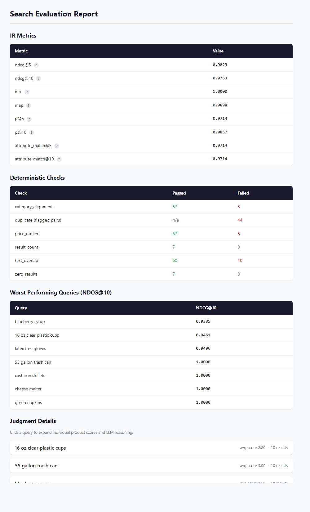
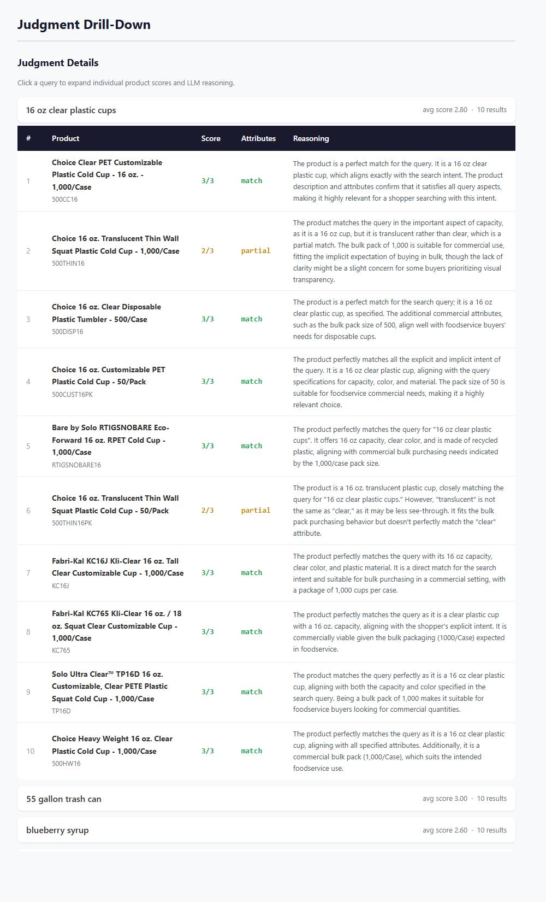

# veritail

LLM-as-a-Judge evaluation framework tailored for ecommerce search.

veritail scores every query-result pair, computes IR metrics from those scores, and runs deterministic quality checks — all in a single command. Run it on every release to track search quality, or compare two configurations side by side to measure the impact of a change before it ships.

Five evaluation layers:
- **LLM-as-a-Judge scoring** — every query-result pair scored 0-3 with structured reasoning, using any cloud or local model
- **IR metrics** — NDCG, MRR, MAP, Precision, and attribute match computed from LLM scores
- **Deterministic quality checks** — low result counts, near-duplicate results, out-of-stock ranking issues, price outliers, and more
- **Autocorrect evaluation** — catches intent-altering or unnecessary query corrections
- **Autocomplete evaluation** — deterministic checks and LLM-based semantic evaluation for type-ahead suggestions

Includes 14 built-in ecommerce verticals for domain-aware judging, with support for custom vertical context and rubrics.

## Preview

Example output from a real run:

<p align="center">
  
</p>
<p align="center">
  <em>Overview report: IR metrics, deterministic checks, and worst-performing queries.</em>
</p>
<p align="center">
  <em>See the detailed per-query drill-down screenshot in the <a href="#html-report">HTML Report</a> section below.</em>
</p>

## Quick Start

### 1. Install

```bash
pip install veritail                   # OpenAI + local models (default)
pip install veritail[anthropic]        # + Claude support
pip install veritail[gemini]           # + Gemini support
pip install veritail[cloud]            # all three cloud providers
pip install veritail[cloud,langfuse]   # everything
```

The base install includes the OpenAI SDK because it doubles as the client for OpenAI-compatible local servers (Ollama, vLLM, LM Studio, etc.) — so `pip install veritail` works with both cloud and local models out of the box.

### 2. Bootstrap starter files (recommended)

```bash
veritail init
```

This generates:
- `adapter.py` with a real HTTP request skeleton for both `search()` and `suggest()` (endpoint, auth header, timeout, JSON parsing)
- `queries.csv` with example search queries (query types are automatically classified by the LLM during evaluation)
- `prefixes.csv` with example prefixes (prefix types are automatically inferred from character count)

By default, existing files are not overwritten. Use `--force` to overwrite.

### 3. Create a query set (manual option)

```csv
query
red running shoes
wireless earbuds
nike air max 90
```

Optional columns: `type` (navigational, broad, long_tail, attribute) and `category`. When omitted, `type` is automatically classified by the LLM judge before evaluation.

### 4. Generate queries with an LLM (alternative)

If you don't have query logs yet, let an LLM generate a starter set:

```bash
# From a built-in vertical
veritail generate-queries --vertical electronics --output queries.csv --llm-model gpt-4o

# From business context
veritail generate-queries --context "B2B industrial fastener distributor" --output queries.csv --llm-model gpt-4o

# Both vertical and context, custom count
veritail generate-queries \
  --vertical foodservice \
  --context "BBQ restaurant equipment supplier" \
  --output queries.csv \
  --count 50 \
  --llm-model gpt-4o
```

This writes a CSV with `query`, `type`, `category`, and `source` columns. Review and edit the generated queries before running an evaluation — the file is designed for human-in-the-loop review.

**Cost note:** Query generation makes a single LLM call (a fraction of a cent with most cloud models).

### 5. Create an adapter (manual option)

```python
# my_adapter.py
from veritail import SearchResponse, SearchResult


def search(query: str) -> SearchResponse:
    results = my_search_api.query(query)
    items = [
        SearchResult(
            product_id=r["id"],
            title=r["title"],
            description=r["description"],
            category=r["category"],
            price=r["price"],
            position=i,
            in_stock=r.get("in_stock", True),
            attributes=r.get("attributes", {}),
        )
        for i, r in enumerate(results)
    ]
    return SearchResponse(results=items)
    # To report autocorrect / "did you mean" corrections:
    # return SearchResponse(results=items, corrected_query="corrected text")
```

Adapters can return either `SearchResponse` or a bare `list[SearchResult]` (backward compatible). Use `SearchResponse` when your search engine returns autocorrect information.

### 6. Run evaluation

```bash
export OPENAI_API_KEY=sk-...

veritail run \
  --queries queries.csv \
  --adapter my_adapter.py \
  --llm-model gpt-4o \
  --top-k 10 \
  --open
```

**LLM API usage:** A full run may make several types of LLM calls:

| Call type | Volume |
|---|---|
| Query type classification | 1 per query (skipped when `type` column is provided in the CSV) |
| Relevance judgment | 1 per query-result pair (queries × `--top-k`) |
| Autocorrect judgment | 1 per corrected query (only when adapter returns `corrected_query`) |
| Autocomplete judgment | 1 per prefix with non-empty suggestions (only with `--autocomplete`) |

Use `--top-k` and `--sample N` to control call volume. `--batch` reduces cost by 50% with cloud providers. Prompt caching is supported — the shared system prompt is reused across all calls, reducing input token costs on providers that support it. **When using cloud models, be mindful of API costs — use `--sample` for quick iterations and check your provider dashboard to track spend.** Note that product data (titles, descriptions, prices, etc.) is sent to the configured LLM provider for judging. Use a [local model](#local-models-via-openai-compatible-servers) if data must stay on-premise.

Outputs are written under:

```text
eval-results/<generated-or-custom-config-name>/
```

### 7. Compare two search configurations

```bash
veritail run \
  --queries queries.csv \
  --adapter adapter_v1.py --config-name v1 \
  --adapter adapter_v2.py --config-name v2 \
  --llm-model gpt-4o
```

The comparison report shows metric deltas, overlap, rank correlation, and position shifts.

### Batch Mode (50% cost reduction)

Use `--batch` to send all LLM judgment calls through the provider's batch API. This reduces cost by 50% but takes longer (typically minutes for small batches). Works with both search relevance judgments and autocomplete LLM evaluation. Veritail polls for completion every 60 seconds. The polling calls are free management API requests and do not consume tokens or incur additional charges.

```bash
veritail run --queries queries.csv --adapter adapter.py \
    --llm-model gpt-4o --batch
```

Supported providers: OpenAI, Anthropic, and Google Gemini.

Not supported with local models (`--llm-base-url`).

### Resuming Interrupted Runs

Use `--resume` to pick up where a previous run left off. This is useful when a run is interrupted by a network error, timeout, or Ctrl-C — you don't have to re-evaluate queries that already completed.

```bash
veritail run --queries queries.csv --adapter adapter.py \
    --llm-model gpt-4o --config-name my-eval --resume
```

`--resume` requires `--config-name` so veritail can locate the previous run's experiment directory under `--output-dir` (default `./eval-results`). The directory must already exist from a prior run.

**Config mismatch detection:** On resume, veritail checks the saved `config.json` and rejects the run if `--llm-model`, `--rubric`, or `--top-k` differ from the original. This prevents silently mixing results from different configurations.

**How it works — non-batch mode:**

In non-batch mode (`--resume` without `--batch`), veritail reads the existing `judgments.jsonl` file and identifies which query indices have already been judged. Completed queries are skipped and their judgments are reloaded into memory. New judgments are appended to the same file. Correction evaluations are only run for queries processed in the current resumption, not for previously completed queries.

**How it works — batch mode:**

In batch mode (`--resume --batch`), veritail saves a `checkpoint.json` to the experiment directory immediately after submitting a batch. The checkpoint records the batch ID, all request context (queries, results, deterministic checks), and provider-specific state. On resume, if a checkpoint exists, veritail skips adapter calls and batch submission entirely and jumps straight to polling for the in-flight batch. If the batch has already completed, results are retrieved immediately.

If a batch fails (e.g. provider error or expiration), the checkpoint is automatically cleared and the error message instructs you to re-run without `--resume` to start a fresh batch.

Autocomplete LLM evaluation uses a separate checkpoint (`ac-checkpoint.json`) with the same resume semantics.

**Dual-config mode:** `--resume` works with dual-config comparison runs. Each configuration's experiment directory is checked independently, and each resumes from its own progress.

## Vertical Guidance

`--vertical` injects domain-specific scoring guidance into the judge prompt. Each vertical teaches the LLM judge what matters most in a particular ecommerce domain — the hard constraints, industry jargon, certification requirements, and category-specific nuances that generic relevance scoring would miss.

Choose the vertical that best matches the ecommerce site you are evaluating.

| Vertical | Description | Example retailers |
|---|---|---|
| `automotive` | Aftermarket, OEM, and remanufactured parts for cars, trucks, and light vehicles | RockAuto, AutoZone, FCP Euro |
| `beauty` | Skincare, cosmetics, haircare, fragrance, and body care | Sephora, Ulta Beauty, Dermstore |
| `electronics` | Consumer electronics and computer components | Best Buy, Newegg, B&H Photo |
| `fashion` | Clothing, shoes, and accessories | Nordstrom, ASOS, Zappos |
| `foodservice` | Commercial kitchen equipment and supplies for restaurants, cafeterias, and catering | WebstaurantStore, Katom, TigerChef |
| `furniture` | Furniture and home furnishings for residential, commercial, and contract use | Wayfair, Pottery Barn, IKEA |
| `groceries` | Online grocery retail covering food, beverages, and household essentials | Instacart, Amazon Fresh, FreshDirect |
| `home-improvement` | Building materials, hardware, plumbing, electrical, and tools for contractors and DIY | Home Depot, Lowe's, Menards |
| `industrial` | Industrial supply and MRO (Maintenance, Repair, and Operations) | Grainger, McMaster-Carr, Fastenal |
| `marketplace` | Multi-seller marketplace platforms | Amazon, eBay, Etsy |
| `medical` | Medical and surgical supplies for hospitals, clinics, and home health | Henry Schein, Medline, McKesson |
| `office-supplies` | Office products, ink/toner, paper, and workspace equipment | Staples, Office Depot, W.B. Mason |
| `pet-supplies` | Pet food, treats, toys, health products, and habitat equipment across all species | Chewy, PetSmart, Petco |
| `sporting-goods` | Athletic equipment, apparel, and accessories across all sports and outdoor activities | Dick's Sporting Goods, REI, Academy Sports |

You can also provide a custom vertical as a plain text file with `--vertical ./my_vertical.txt`. Use the built-in verticals in `src/veritail/verticals/` as templates.

Examples:

```bash
# Built-in vertical
veritail run \
  --queries queries.csv \
  --adapter my_adapter.py \
  --vertical foodservice

# Custom vertical text file
veritail run \
  --queries queries.csv \
  --adapter my_adapter.py \
  --vertical ./my_vertical.txt

# Vertical + business context
veritail run \
  --queries queries.csv \
  --adapter my_adapter.py \
  --vertical foodservice \
  --context "B2B supplier specializing in BBQ restaurant equipment"

# Vertical + detailed business context from a file
veritail run \
  --queries queries.csv \
  --adapter my_adapter.py \
  --vertical home-improvement \
  --context context.txt
```

## Evaluation Model

### LLM relevance judgments

Each query-result pair gets:
- `SCORE`: `0` to `3`
- `ATTRIBUTES`: `match | partial | mismatch | n/a`
- `REASONING`: concise justification

Default rubric criteria:
- explicit intent match
- implicit intent match
- category alignment
- attribute matching
- commercial viability

### Deterministic checks

**Query-level**
- zero results
- low result count warning (`< 3`)

**Result-level**
- text overlap (Jaccard)
- price outlier detection (IQR)
- near-duplicate detection (title similarity threshold)
- out-of-stock prominence (position 1 = fail, positions 2-5 = warning)

**Correction-level** (when adapter returns `corrected_query`)
- correction vocabulary (do corrected terms appear in results?)
- unnecessary correction (do original terms still appear in results?)

**Comparison-level** (dual-config only)
- result overlap (Jaccard)
- rank correlation (Spearman)
- position shift detection

### IR metrics

Computed from LLM scores:
- `ndcg@5`, `ndcg@10`
- `mrr`
- `map`
- `p@5`, `p@10`
- `attribute_match@5`, `attribute_match@10`

## Autocorrect Evaluation

When your search engine corrects queries (autocorrect / "did you mean"), veritail automatically evaluates correction quality. No opt-in flag needed — return `corrected_query` from your adapter and veritail handles the rest.

**How it works:**

1. Your adapter returns `SearchResponse(results=..., corrected_query="corrected text")`
2. veritail runs two free deterministic checks per corrected query:
   - **correction_vocabulary**: Are the corrected terms actually present in result titles/descriptions? (Catches phantom corrections like "plats" → "planes" in foodservice)
   - **unnecessary_correction**: Do the original terms still appear in results? (Catches over-correction like "Cambro" → "Camaro" when results contain Cambro products)
3. veritail makes one LLM call per corrected query to judge whether the correction was appropriate or inappropriate
4. Result-level LLM prompts include both original and corrected queries for richer reasoning

**Output:**
- Console: separate progress bar for correction evaluations, summary with call count
- Terminal report: "Query Corrections" table with verdict and reasoning
- HTML report: correction summary table + per-query drill-down showing `original → corrected (verdict)`
- `corrections.jsonl` written alongside `metrics.json`

**Cost:** One extra LLM call per corrected query (not per result). If your adapter corrects 15 of 50 queries, that's 15 extra calls.

## Autocomplete Evaluation

veritail includes a standalone autocomplete (type-ahead) evaluation mode. It runs deterministic quality checks and LLM-based semantic evaluation against your suggestion engine.

### Prefix set format

Provide a CSV or JSON file with a `prefix` column. Prefix types are automatically inferred from character count (short/mid/long), or you can provide an optional `type` column to override:

```csv
prefix
he
hea
headph
headphones w
```

### Suggest adapter

Add a `suggest` function to your adapter module:

```python
# adapter.py
from veritail import AutocompleteResponse


def suggest(prefix: str) -> AutocompleteResponse:
    results = my_autocomplete_api.suggest(prefix)
    return AutocompleteResponse(suggestions=results)
    # Or simply: return results  (a bare list[str] is also accepted)
```

If your adapter only has `suggest()`, search evaluation is skipped.

### Quick start

```bash
veritail run \
  --autocomplete prefixes.csv \
  --adapter adapter.py \
  --llm-model gpt-4o \
  --open
```

### Built-in checks

All checks below are deterministic and run alongside the LLM evaluation.

| Check | What it catches |
|---|---|
| `empty_suggestions` | Prefix returned zero suggestions |
| `duplicate_suggestion` | Exact duplicate suggestions (case-insensitive) |
| `prefix_coherence` | Suggestion neither starts with the prefix nor shares a token with it |
| `offensive_content` | Suggestion contains a blocked term (requires blocklist) |
| `encoding_issues` | HTML entities, control characters, or leading/trailing whitespace |
| `length_anomaly` | Suggestion shorter than 2 characters or longer than 80 characters |
| `latency` | Adapter response time exceeds threshold (default 200 ms) |

### Comparison mode

Pass two adapters to run an A/B comparison:

```bash
veritail run \
  --autocomplete prefixes.csv \
  --adapter adapter_v1.py --config-name v1 \
  --adapter adapter_v2.py --config-name v2
```

In addition to per-adapter checks, comparison mode adds:
- **suggestion_overlap**: Jaccard index of normalized suggestions between configurations
- **rank_agreement**: Spearman rank correlation for shared suggestions

### Custom checks

Add domain-specific checks with `--autocomplete-checks`. Each `check_*` function receives `(prefix: str, suggestions: list[str])` and returns `list[CheckResult]`:

```python
# my_autocomplete_checks.py
from veritail.types import CheckResult


def check_brand_prefix(prefix: str, suggestions: list[str]) -> list[CheckResult]:
    """Flag suggestions that don't preserve a known brand prefix."""
    checks = []
    for s in suggestions:
        if prefix.lower() in ("sony", "sam") and not s.lower().startswith(prefix.lower()):
            checks.append(
                CheckResult(
                    check_name="brand_prefix",
                    query=prefix,
                    passed=False,
                    detail=f"'{s}' does not start with brand prefix '{prefix}'",
                )
            )
    return checks
```

```bash
veritail run \
  --autocomplete prefixes.csv \
  --adapter adapter.py \
  --autocomplete-checks my_autocomplete_checks.py
```

### Output

- **Terminal report**: check pass/fail summary, per-prefix drill-down
- **HTML report**: standalone report with per-prefix detail (open with `--open`)

### LLM-based semantic evaluation

In addition to deterministic checks, veritail automatically runs LLM-based semantic evaluation for single-adapter autocomplete. This evaluates whether suggestions are semantically relevant to the user's intent, diverse across shopping intents, and appropriate for the store's vertical.

```bash
# Autocomplete-only with LLM evaluation
veritail run \
  --autocomplete prefixes.csv \
  --adapter adapter.py \
  --llm-model gpt-4o

# With vertical and business context
veritail run \
  --autocomplete prefixes.csv \
  --adapter adapter.py \
  --llm-model gpt-4o \
  --vertical home-improvement \
  --context "Big-box home improvement retailer"

# Combined with search evaluation
veritail run \
  --queries queries.csv \
  --autocomplete prefixes.csv \
  --adapter adapter.py \
  --llm-model gpt-4o

# Batch mode (50% cheaper, slower)
veritail run \
  --autocomplete prefixes.csv \
  --adapter adapter.py \
  --llm-model gpt-4o --batch
```

**What it evaluates** (per prefix):
- **Relevance** (0-3): Do suggestions match the likely shopping intent?
- **Diversity** (0-3): Do suggestions cover different categories and use cases?
- **Flagged suggestions**: Individual suggestions that are unrelated, offensive, or duplicative

**Output:**
- Console: LLM Suggestion Quality summary, flagged suggestions detail, lowest relevance scores
- HTML report: LLM summary table, flagged details, per-prefix relevance/diversity scores
- `suggestion-judgments.jsonl` written alongside other evaluation artifacts

**Cost:** One LLM call per prefix. A run with 100 prefixes makes 100 calls (prefixes with empty suggestions are skipped).

## CLI Reference

### `veritail run`

Run a single or dual-configuration evaluation.

| Option | Default | Description |
|---|---|---|
| `--queries` | *(optional)* | Path to query set (`.csv` or `.json`). Optional, but at least one of `--queries` or `--autocomplete` is required |
| `--autocomplete` | *(optional)* | Path to autocomplete prefix set (`.csv` or `.json`). Optional, but at least one of `--queries` or `--autocomplete` is required. The adapter must export a `suggest()` function when this flag is used |
| `--adapter` | *(required)* | Path to adapter module. Always required; pass up to 2 for dual-config comparison mode |
| `--config-name` | *(optional)* | Name for each configuration (up to 2). If omitted, names are auto-generated |
| `--llm-model` | *(conditional)* | LLM model for judgments (e.g. `gpt-4o`, `claude-sonnet-4-5`, `gemini-2.5-flash`). Required when `--queries` or `--autocomplete` is provided with a single adapter |
| `--llm-base-url` | *(none)* | Base URL for an OpenAI-compatible endpoint (e.g. `http://localhost:11434/v1` for Ollama) |
| `--llm-api-key` | *(none)* | API key override for the endpoint |
| `--rubric` | `ecommerce-default` | Rubric name or custom rubric file path |
| `--backend` | `file` | Storage backend (`file` or `langfuse`) |
| `--output-dir` | `./eval-results` | Output directory (file backend) |
| `--top-k` | `10` | Maximum number of results to evaluate per query (must be `>= 1`) |
| `--open` | off | Open HTML report in browser |
| `--context` | *(none)* | Business context for LLM judge — business identity, customer base, query interpretation guidance, and enterprise-specific evaluation rules (brand priorities, certification requirements, domain jargon). Accepts a string or a path to a text file |
| `--vertical` | *(none)* | Built-in vertical (`automotive`, `beauty`, `electronics`, `fashion`, `foodservice`, `furniture`, `groceries`, `home-improvement`, `industrial`, `marketplace`, `medical`, `office-supplies`, `pet-supplies`, `sporting-goods`) or path to text file |
| `--checks` | *(none)* | Path to custom check module(s) with `check_*` functions for search evaluation (repeatable) |
| `--autocomplete-checks` | *(none)* | Path to custom check module(s) with `check_*` functions for autocomplete evaluation (repeatable) |
| `--sample` | *(none)* | Randomly sample N queries/prefixes for a faster evaluation (deterministic seed) |
| `--batch` | off | Use provider batch API for LLM calls (50% cheaper, slower). Works with both search and autocomplete evaluation. Supported for OpenAI, Anthropic, and Gemini. Not compatible with `--llm-base-url` |
| `--resume` | off | Resume a previously interrupted run. Requires `--config-name` to identify the previous run. In non-batch mode, skips queries already judged in `judgments.jsonl`. In batch mode, resumes polling for an in-flight batch from a saved checkpoint. `--llm-model`, `--rubric`, and `--top-k` must match the original run |

If `--config-name` is provided, pass one name per adapter.

#### Flag requirements by mode

**Search evaluation** requires `--queries`, `--adapter`, and `--llm-model`:

```bash
veritail run --queries queries.csv --adapter adapter.py --llm-model gpt-4o
```

**Autocomplete evaluation** requires `--autocomplete`, `--adapter`, and `--llm-model`:

```bash
veritail run --autocomplete prefixes.csv --adapter adapter.py --llm-model gpt-4o
```

**Combined** requires `--queries`, `--autocomplete`, `--adapter`, and `--llm-model`. Both search and autocomplete are evaluated in a single run.

**Dual-config comparison** uses two `--adapter` and two `--config-name` flags:

```bash
veritail run --queries queries.csv --adapter a1.py --config-name v1 --adapter a2.py --config-name v2 --llm-model gpt-4o
```

**Batch mode** (`--batch`) additionally requires a cloud provider model (OpenAI, Anthropic, or Gemini). Not compatible with `--llm-base-url`.

**Resume** (`--resume`) additionally requires `--config-name`. The experiment directory from the previous run must exist, and `--llm-model`, `--rubric`, and `--top-k` must match the original run.

### `veritail init`

Scaffold starter files for a new project.

| Option | Default | Description |
|---|---|---|
| `--dir` | `.` | Target directory for generated files |
| `--adapter-name` | `adapter.py` | Adapter filename (must end with `.py`) |
| `--queries-name` | `queries.csv` | Query set filename (must end with `.csv`) |
| `--force` | off | Overwrite existing files |

### `veritail generate-queries`

Generate evaluation queries with an LLM and save to CSV. At least one of `--vertical` or `--context` is required.

| Option | Default | Description |
|---|---|---|
| `--output` | *(required)* | Output CSV path (must end with `.csv`) |
| `--count` | `25` | Target number of queries to generate (max 50, approximate — see note below) |
| `--vertical` | *(none)* | Built-in vertical name or path to text file |
| `--context` | *(none)* | Business context string or path to a text file |
| `--llm-model` | *(required)* | LLM model for generation (e.g. `gpt-4o`, `claude-sonnet-4-5`, `gemini-2.5-flash`) |
| `--llm-base-url` | *(none)* | Base URL for an OpenAI-compatible endpoint |
| `--llm-api-key` | *(none)* | API key override for the endpoint |

> **Note:** Query counts are approximate. LLMs may return slightly fewer or more queries than requested. The CLI will report the actual count generated. For larger query sets, run the command multiple times or curate queries manually.

### `veritail vertical list`

List all built-in verticals.

### `veritail vertical show <name>`

Print the full text of a built-in vertical. Use this to inspect a vertical before customizing it, or to copy one as a starting point for your own:

```bash
# View a vertical
veritail vertical show home-improvement

# Copy to a file and customize
veritail vertical show home-improvement > my_vertical.txt
```

## HTML Report

`veritail run` always writes a standalone HTML report.

It includes:
- IR metric summary
- deterministic check summary
- worst queries by `ndcg@10`
- per-query result drill-down
- score + attribute verdict + reasoning per result
- deterministic failure annotations
- run metadata footer (timestamp, model, rubric, vertical, top-k, adapter path)

<p align="center">
  
</p>
<p align="center">
  <em>Drill-down report: per-query product scores, attribute verdicts, and LLM reasoning.</em>
</p>

## Custom Rubrics

Provide a Python module with:
- `SYSTEM_PROMPT: str`
- `format_user_prompt(query: str, result: SearchResult) -> str`

```python
# my_rubric.py
from veritail.types import SearchResult

SYSTEM_PROMPT = """You are an expert relevance judge for..."""


def format_user_prompt(query: str, result: SearchResult) -> str:
    return f"Query: {query}\nProduct: {result.title}\n..."
```

Then run with:

```bash
veritail run --queries queries.csv --adapter my_adapter.py --rubric my_rubric.py --llm-model gpt-4o
```

## Enterprise Context

`--context` accepts a short business description or a detailed file with enterprise-specific evaluation guidance. Use a file when your business has domain rules, brand priorities, or jargon that the LLM judge should consider during scoring.

Example `context.txt` for a foodservice supplier:

```text
WebstaurantStore is a B2B commercial foodservice equipment and supplies distributor.
Our customers are restaurant owners, caterers, and institutional buyers.

Key evaluation guidance:
- NSF certification is a hard requirement for all food-contact surfaces. Products
  missing NSF certification should be penalized when the query implies food contact.
- "Cambro" is a major brand in our catalog. Do not confuse it with "Camaro" — queries
  for Cambro products should match Cambro brand items specifically.
- "Hotel pan" always means a steam table pan (gastronorm), not a cooking pan for hotels.
- "Plats" is a common shorthand for "plates" in our customer base.
- Smallwares queries (e.g., "tongs", "ladle", "spatula") should prioritize
  commercial-grade NSF-listed items over residential kitchen tools.
```

```bash
veritail run \
  --queries queries.csv \
  --adapter adapter.py \
  --vertical foodservice \
  --context context.txt \
  --llm-model gpt-4o
```

The context is injected into the LLM system prompt alongside the vertical and rubric. Enterprise rules refine scoring within the existing framework — they guide how the judge interprets queries and weighs product attributes, but they do not override the scoring scale.

### Extending the default rubric

For rare cases where you need a fundamentally different scoring framework, you can extend the built-in rubric instead of writing one from scratch:

```python
# my_rubric.py
from veritail.rubrics.ecommerce_default import (
    SYSTEM_PROMPT as BASE_PROMPT,
    format_user_prompt,
)

SYSTEM_PROMPT = BASE_PROMPT + """

## Additional Scoring Criteria
- When the query specifies a dietary restriction (gluten-free, vegan, kosher),
  treat it as a hard attribute constraint with the same weight as brand or size.
"""
```

```bash
veritail run --queries queries.csv --adapter adapter.py --rubric my_rubric.py --llm-model gpt-4o
```

This preserves the full default rubric (scale definitions, evaluation criteria, response format) while adding your own rules.

## Custom Checks

Add domain-specific deterministic checks without modifying veritail itself. A check module is a Python file containing one or more `check_*` functions:

```python
# my_checks.py
from veritail.types import CheckResult, QueryEntry, SearchResult


def check_species_mismatch(
    query: QueryEntry, results: list[SearchResult]
) -> list[CheckResult]:
    """Flag cross-species results in pet supply searches."""
    checks = []
    for r in results:
        species = r.attributes.get("species")
        if species and species.lower() not in query.query.lower():
            checks.append(
                CheckResult(
                    check_name="species_mismatch",
                    query=query.query,
                    product_id=r.product_id,
                    passed=False,
                    detail=f"Query mentions no '{species}' but result is for {species}",
                )
            )
    return checks
```

Each `check_*` function must:
- Accept `(QueryEntry, list[SearchResult])`
- Return `list[CheckResult]`

Non-callable names starting with `check_` (e.g., `check_threshold = 0.5`) are skipped. Helper functions without the `check_` prefix are ignored.

Run with one or more `--checks` flags:

```bash
veritail run \
  --queries queries.csv \
  --adapter my_adapter.py \
  --checks my_checks.py \
  --checks more_checks.py \
  --llm-model gpt-4o
```

Custom check results appear alongside built-in checks in reports.

## Backends

### File backend (default)

Stores local artifacts under:

```text
eval-results/
  <config-name>/
    config.json
    judgments.jsonl
    metrics.json
    report.html
```

### Langfuse backend

```bash
pip install veritail[langfuse]

export LANGFUSE_PUBLIC_KEY=pk-...
export LANGFUSE_SECRET_KEY=sk-...

veritail run \
  --queries queries.csv \
  --adapter my_adapter.py \
  --backend langfuse \
  --llm-model gpt-4o
```

## Development

```bash
git clone https://github.com/asarnaout/veritail.git
cd veritail
pip install -e ".[dev,cloud]"
```

Run checks:

```bash
pytest
ruff check src tests
mypy src
```

## Supported LLM Providers

veritail works with cloud LLM APIs and any OpenAI-compatible local model server.

### Cloud providers (recommended)

| Provider | Example `--llm-model` | API key env var | Install |
|---|---|---|---|
| **OpenAI** | `gpt-4o`, `gpt-4o-mini`, `o3-mini` | `OPENAI_API_KEY` | included |
| **Anthropic** (Claude) | `claude-sonnet-4-5`, `claude-haiku-4-5` | `ANTHROPIC_API_KEY` | `pip install veritail[anthropic]` |
| **Google Gemini** | `gemini-2.5-flash`, `gemini-2.5-pro` | `GEMINI_API_KEY` or `GOOGLE_API_KEY` | `pip install veritail[gemini]` |

Cloud models provide the highest evaluation quality and are recommended for production use.

### Local models via OpenAI-compatible servers

veritail connects to any server that exposes the [OpenAI chat completions API](https://platform.openai.com/docs/api-reference/chat) (`POST /v1/chat/completions`). Pass `--llm-base-url` to point at a local endpoint:

```bash
# Ollama
ollama pull qwen3:14b
veritail run \
  --queries queries.csv \
  --adapter my_adapter.py \
  --llm-model qwen3:14b \
  --llm-base-url http://localhost:11434/v1 \
  --llm-api-key not-needed

# vLLM
veritail run \
  --queries queries.csv \
  --adapter my_adapter.py \
  --llm-model meta-llama/Llama-4-Scout \
  --llm-base-url http://localhost:8000/v1 \
  --llm-api-key not-needed

# LM Studio
veritail run \
  --queries queries.csv \
  --adapter my_adapter.py \
  --llm-model local-model \
  --llm-base-url http://localhost:1234/v1 \
  --llm-api-key lm-studio
```

`--llm-base-url` and `--llm-api-key` also work with `veritail generate-queries`.

Alternatively, you can set environment variables instead of passing CLI flags:

```bash
export OPENAI_BASE_URL=http://localhost:11434/v1
export OPENAI_API_KEY=not-needed
veritail run --queries queries.csv --adapter my_adapter.py --llm-model qwen3:14b
```

**Tested local servers:**

| Server | Default port | Docs |
|---|---|---|
| [Ollama](https://ollama.com/) | `11434` | [OpenAI compatibility](https://ollama.com/blog/openai-compatibility) |
| [vLLM](https://docs.vllm.ai/) | `8000` | [OpenAI-compatible server](https://docs.vllm.ai/en/stable/serving/openai_compatible_server/) |
| [LM Studio](https://lmstudio.ai/) | `1234` | [API docs](https://lmstudio.ai/docs/developer/openai-compat) |
| [LocalAI](https://localai.io/) | `8080` | [Features](https://localai.io/features/) |
| [llama.cpp server](https://github.com/ggml-org/llama.cpp) | `8080` | [Server docs](https://github.com/ggml-org/llama.cpp/blob/master/examples/server/README.md) |
| [SGLang](https://docs.sglang.io/) | varies | [Docs](https://docs.sglang.io/) |

### Model quality guidance

veritail computes aggregate IR metrics (NDCG, MRR, MAP) from LLM relevance scores. The reliability of these metrics depends on the LLM's ability to follow instructions and produce consistent judgments.

| Model tier | Examples | Metric reliability |
|---|---|---|
| Frontier cloud models | Claude Sonnet/Opus, GPT-4o, GPT-o3 | High — recommended for production evaluation |
| Large local models (70B+) | Llama 4 Maverick, Qwen 3 72B, DeepSeek V3 | Good — comparable to cloud models with sufficient hardware |
| Mid-size local models (14B–30B) | Qwen 3 14B/30B, Phi-4 14B, Mistral 7x8B | Adequate — some scoring noise; suitable for rapid iteration |
| Small local models (≤8B) | Llama 3.2 3B, Phi-4-mini, Gemma 3 4B | Noisy — scores may be inconsistent and affect metric reliability |

For reliable metrics that can inform production search decisions, we recommend frontier cloud models or 70B+ parameter local models. Smaller models are useful for fast, low-cost iteration during development but their scores should be interpreted with caution.

## Requirements

- Python >= 3.9
- An LLM provider — one of:
  - [OpenAI](https://platform.openai.com/) API key (included with base install)
  - [Anthropic](https://console.anthropic.com/) API key (`pip install veritail[anthropic]`)
  - [Google Gemini](https://ai.google.dev/) API key (`pip install veritail[gemini]`)
  - A running OpenAI-compatible local model server (no extra install needed — see [Local models](#local-models-via-openai-compatible-servers) above)

## Disclaimer

veritail uses large language models to generate relevance judgments. LLM outputs can be inaccurate, inconsistent, or misleading. All scores, reasoning, and reports produced by this tool should be reviewed by a qualified human before informing production decisions. veritail is an evaluation aid, not a substitute for human judgment. The authors are not liable for any decisions made based on its output or for any API costs incurred by running evaluations. Users are responsible for complying with the terms of service of any LLM provider they use with this tool.

## License

MIT
