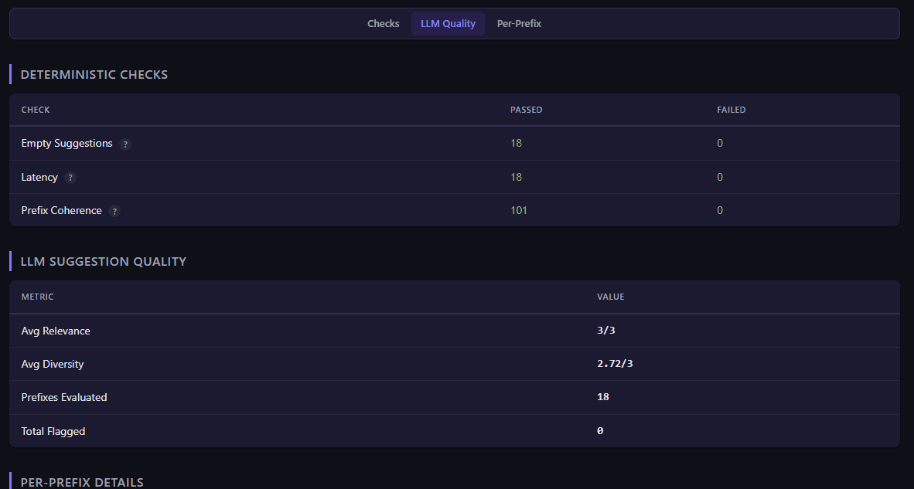
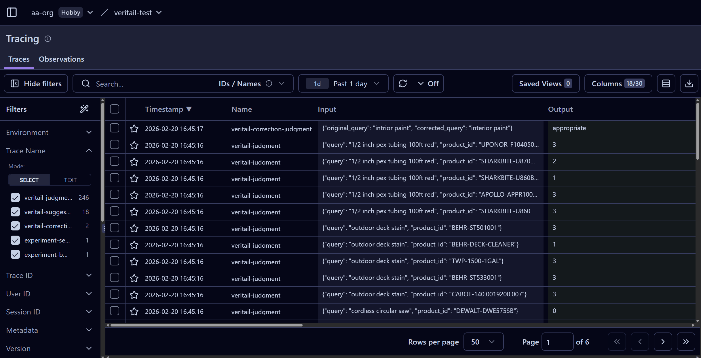

# veritail

LLM evals framework tailored for ecommerce search.

veritail scores every query-result pair, computes IR metrics from those scores, and runs deterministic quality checks — all in a single command. Run it on every release to track search quality, or compare two configurations side by side to measure the impact of a change before it ships.

Five evaluation layers:
- **LLM-as-a-Judge scoring** — every query-result pair scored 0-3 with structured reasoning, using any cloud or local model
- **IR metrics** — NDCG, MRR, MAP, Precision, and attribute match computed from LLM scores
- **Deterministic quality checks** — low result counts, near-duplicate results, out-of-stock ranking issues, price outliers, and more
- **Autocorrect evaluation** — catches intent-altering or unnecessary query corrections
- **Autocomplete evaluation** — deterministic checks and LLM-based semantic evaluation for type-ahead suggestions

Includes 14 built-in ecommerce verticals for domain-aware judging, with support for custom vertical context and rubrics. Optional [Langfuse](docs/backends.md#langfuse-backend) integration for full observability — every judgment, score, and LLM call traced and grouped by evaluation run.

<p align="center">
  
</p>
<p align="center">
  <em>LLM-as-a-Judge scores every query-result pair, computes NDCG/MRR/MAP/Precision, runs deterministic checks, and evaluates autocorrect behavior.</em>
</p>

## Quick Start

### 1. Install

```bash
pip install veritail                   # OpenAI + local models (default)
pip install veritail[anthropic]        # + Claude support
pip install veritail[gemini]           # + Gemini support
pip install veritail[cloud]            # all three cloud providers
pip install veritail[cloud,langfuse]   # everything
```

The base install includes the OpenAI SDK because it doubles as the client for OpenAI-compatible local servers (Ollama, vLLM, LM Studio, etc.) — so `pip install veritail` works with both cloud and local models out of the box.

### 2. Bootstrap starter files (recommended)

```bash
veritail init
```

This generates:
- `adapter.py` with a real HTTP request skeleton for both `search()` and `suggest()` (endpoint, auth header, timeout, JSON parsing)
- `queries.csv` with example search queries (query types are automatically classified by the LLM during evaluation)
- `prefixes.csv` with example prefixes (prefix types are automatically inferred from character count)

By default, existing files are not overwritten. Use `--force` to overwrite.

### 3. Create a query set (manual option)

```csv
query
red running shoes
wireless earbuds
nike air max 90
```

Optional columns: `type` (navigational, broad, long_tail, attribute) and `category`. When omitted, `type` is automatically classified by the LLM judge before evaluation.

### 4. Generate queries with an LLM (alternative)

If you don't have query logs yet, let an LLM generate a starter set:

```bash
# From a built-in vertical
veritail generate-queries --vertical electronics --output queries.csv --llm-model gpt-4o

# From business context
veritail generate-queries --context "B2B industrial fastener distributor" --output queries.csv --llm-model gpt-4o

# Both vertical and context, custom count
veritail generate-queries \
  --vertical foodservice \
  --context "BBQ restaurant equipment supplier" \
  --output queries.csv \
  --count 50 \
  --llm-model gpt-4o
```

This writes a CSV with `query`, `type`, `category`, and `source` columns. Review and edit the generated queries before running an evaluation — the file is designed for human-in-the-loop review.

**Cost note:** Query generation makes a single LLM call (a fraction of a cent with most cloud models).

### 5. Create an adapter (manual option)

```python
# my_adapter.py
from veritail import SearchResponse, SearchResult


def search(query: str) -> SearchResponse:
    results = my_search_api.query(query)
    items = [
        SearchResult(
            product_id=r["id"],
            title=r["title"],
            description=r["description"],
            category=r["category"],
            price=r["price"],
            position=i,
            in_stock=r.get("in_stock", True),
            attributes=r.get("attributes", {}),
        )
        for i, r in enumerate(results)
    ]
    return SearchResponse(results=items)
    # To report autocorrect / "did you mean" corrections:
    # return SearchResponse(results=items, corrected_query="corrected text")
```

Adapters can return either `SearchResponse` or a bare `list[SearchResult]` (backward compatible). Use `SearchResponse` when your search engine returns autocorrect information.

### 6. Run evaluation

```bash
export OPENAI_API_KEY=sk-...

veritail run \
  --queries queries.csv \
  --adapter my_adapter.py \
  --llm-model gpt-4o \
  --top-k 10 \
  --open
```

For a detailed breakdown of API call volume and cost control options, see [LLM Usage & Cost](docs/llm-usage-and-cost.md).

Outputs are written under:

```text
eval-results/<generated-or-custom-config-name>/
```

### 7. Compare two search configurations

```bash
veritail run \
  --queries queries.csv \
  --adapter bm25_search_adapter.py --config-name bm25-baseline \
  --adapter semantic_search_adapter.py --config-name semantic-v2 \
  --llm-model gpt-4o
```

The comparison report shows metric deltas, overlap, rank correlation, and position shifts.

## Vertical Guidance

`--vertical` injects domain-specific scoring guidance into the judge prompt. Each vertical teaches the LLM judge what matters most in a particular ecommerce domain — the hard constraints, industry jargon, certification requirements, and category-specific nuances that generic relevance scoring would miss.

Choose the vertical that best matches the ecommerce site you are evaluating.

| Vertical | Description | Example retailers |
|---|---|---|
| `automotive` | Aftermarket, OEM, and remanufactured parts for cars, trucks, and light vehicles | RockAuto, AutoZone, FCP Euro |
| `beauty` | Skincare, cosmetics, haircare, fragrance, and body care | Sephora, Ulta Beauty, Dermstore |
| `electronics` | Consumer electronics and computer components | Best Buy, Newegg, B&H Photo |
| `fashion` | Clothing, shoes, and accessories | Nordstrom, ASOS, Zappos |
| `foodservice` | Commercial kitchen equipment and supplies for restaurants, cafeterias, and catering | WebstaurantStore, Katom, TigerChef |
| `furniture` | Furniture and home furnishings for residential, commercial, and contract use | Wayfair, Pottery Barn, IKEA |
| `groceries` | Online grocery retail covering food, beverages, and household essentials | Instacart, Amazon Fresh, FreshDirect |
| `home-improvement` | Building materials, hardware, plumbing, electrical, and tools for contractors and DIY | Home Depot, Lowe's, Menards |
| `industrial` | Industrial supply and MRO (Maintenance, Repair, and Operations) | Grainger, McMaster-Carr, Fastenal |
| `marketplace` | Multi-seller marketplace platforms | Amazon, eBay, Etsy |
| `medical` | Medical and surgical supplies for hospitals, clinics, and home health | Henry Schein, Medline, McKesson |
| `office-supplies` | Office products, ink/toner, paper, and workspace equipment | Staples, Office Depot, W.B. Mason |
| `pet-supplies` | Pet food, treats, toys, health products, and habitat equipment across all species | Chewy, PetSmart, Petco |
| `sporting-goods` | Athletic equipment, apparel, and accessories across all sports and outdoor activities | Dick's Sporting Goods, REI, Academy Sports |

You can also provide a custom vertical as a plain text file with `--vertical ./my_vertical.txt`. Use the built-in verticals in `src/veritail/verticals/` as templates.

Use `--context` to layer enterprise-specific rules on top of a vertical — things like brand priorities, certification requirements, or domain jargon unique to your store. See [Custom Rubrics & Enterprise Context](docs/custom-rubrics.md) for details.

Examples:

```bash
# Built-in vertical
veritail run \
  --queries queries.csv \
  --adapter my_adapter.py \
  --vertical foodservice

# Custom vertical text file
veritail run \
  --queries queries.csv \
  --adapter my_adapter.py \
  --vertical ./my_vertical.txt

# Vertical + enterprise-specific rules
veritail run \
  --queries queries.csv \
  --adapter my_adapter.py \
  --vertical home-improvement \
  --context "Pro contractor supplier. Queries for lumber should always prioritize pressure-treated options."

# Vertical + detailed business context from a file
veritail run \
  --queries queries.csv \
  --adapter my_adapter.py \
  --vertical home-improvement \
  --context context.txt
```

## More Reports

### Evaluate autocomplete suggestions

<br>

<p align="center">
  
</p>
<p align="center">
  <em>Deterministic checks (duplicates, prefix coherence, encoding) and LLM-based semantic scoring for suggestion relevance and diversity.</em>
</p>

---

### Side-by-side comparison

<br>

<p align="center">
  
</p>
<p align="center">
  <em>Two search configurations compared head-to-head: per-query NDCG deltas, win/loss/tie analysis, rank correlation, and result overlap.</em>
</p>

---

### Langfuse observability

<br>

<p align="center">
  
</p>
<p align="center">
  <em>Every judgment, score, and LLM call traced and grouped by evaluation run — with full prompt/response visibility.</em>
</p>

## Documentation

| Guide | Description |
|---|---|
| [Evaluation Model](docs/evaluation-model.md) | LLM judgment scoring, deterministic checks, and IR metrics |
| [Supported LLM Providers](docs/supported-llm-providers.md) | Cloud providers, local model servers, and model quality guidance |
| [LLM Usage & Cost](docs/llm-usage-and-cost.md) | API call volume breakdown and cost control strategies |
| [Batch Mode & Resume](docs/batch-mode-and-resume.md) | 50% cost reduction via batch APIs and resuming interrupted runs |
| [Autocorrect Evaluation](docs/autocorrect-evaluation.md) | Evaluating query correction quality |
| [Autocomplete Evaluation](docs/autocomplete-evaluation.md) | Type-ahead suggestion evaluation with checks and LLM scoring |
| [Custom Rubrics & Enterprise Context](docs/custom-rubrics.md) | Custom scoring rubrics and business-specific evaluation rules |
| [Custom Checks](docs/custom-checks.md) | Adding domain-specific deterministic checks |
| [CLI Reference](docs/cli-reference.md) | Complete flag reference for all commands |
| [Backends](docs/backends.md) | File and Langfuse storage backends |
| [Development](docs/development.md) | Local development setup and running tests |

## Disclaimer

veritail uses large language models to generate relevance judgments. LLM outputs can be inaccurate, inconsistent, or misleading. All scores, reasoning, and reports produced by this tool should be reviewed by a qualified human before informing production decisions. veritail is an evaluation aid, not a substitute for human judgment. The authors are not liable for any decisions made based on its output or for any API costs incurred by running evaluations. Users are responsible for complying with the terms of service of any LLM provider they use with this tool. Evaluation data is sent to the configured LLM provider for scoring — use a local model if data must stay on-premise.

## License

MIT
